

# Kumo 2.5"
---
A 2.5" drone frame. Star shaped dual arm design available both in printable and carbon fiber cut files in [[STL]] and [[CAD]] formats.

This project was born out of the desire for building a robust freestyle 2.5" 2S quad built from the ground up around the HDZero AIO15 and Lux camera. Something with a bit more power and wind resilience than a whoop, but still relatively quiet and survivable to crashes. Some of the mono-body frames seem to have lightweight arms that are a bit flimsy, thus the star shape was opted in the newer versions of the Kumo frame. 

My vision for this project was to create an open-source frame design that could be iterated and shared with accessible options. 

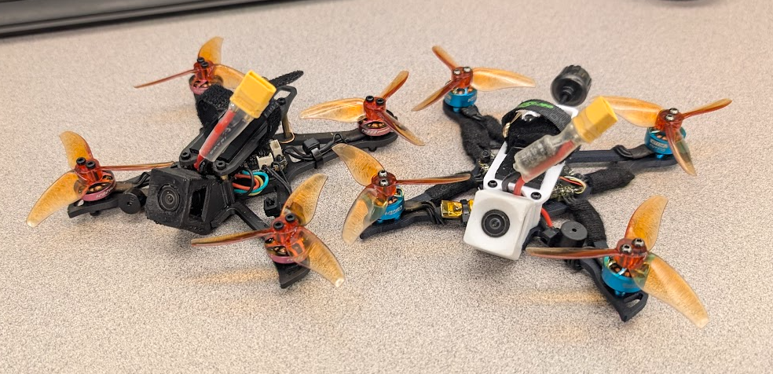

## Contents:

1. [Elements](#elements)
2. [Design](#design)
3. [Recommended Setup](#recommended-setup)
4. [Videos](#Videos)
5. [Changelog/Versions](#Changelog/Versions)

## Elements

- Open Source as CC-BY 4.0
- Designed as a more robust toothpick with AIO or other light stacks. Primarily the HDZero AIO15
- Squished X geometry (4mm stubbier to get the props a bit less in frame)
- Slam deck to keep center of gravity along propeller line
- Rigid Design
- Camera mount designed for 25/35deg HDZero Lux. Also compatible with the [Kayoumini camera mounts ](https://www.printables.com/model/1330393-kayoumini-camera-tpu-print-support)
## Design

### Frame Design
Cutout for HDZero AIO15 to reduce height while also keeping ports accessible.
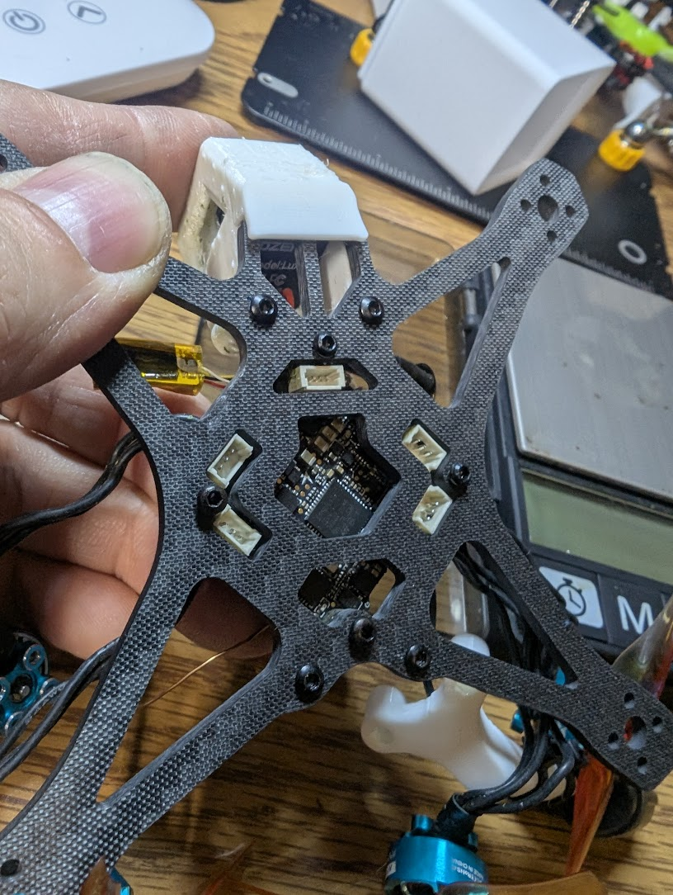

Squished X geometry set at just under 85deg between front/back. Reduces prop in frame, however roll vs pitch movement requires less inertia due to weight distribution along Y axis.
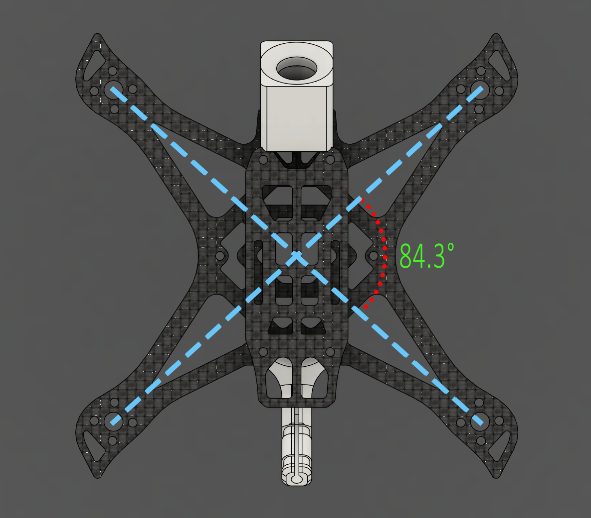
#### Slam Deck and Center of gravity
Keeping the center of gravity low with 8-12mm standoffs helps reduce effort in flips. Sweet spot for avoiding battery strikes with props sits around 10-11mm standoff while also providing plenty of room for wire routing. For a tighter fit, 8-9mm standoffs can be used. Photo below is of 11mm standoff.

### Camera mount
Designed with compatibility in mind with camera mounts from [Kayoumini](https://www.printables.com/model/1330393-kayoumini-camera-tpu-print-support) This sample mount for HDZero Lux at 35 degrees offers a balance between racing and freestyle. Print in TPU to dampen vibrations and soften impacts.
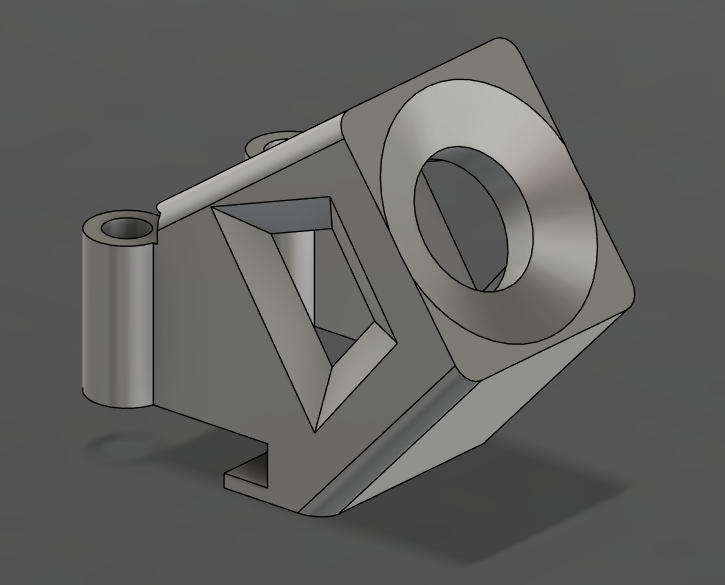
### Printed frame vs Carbon Fiber
Original test builds used a variety of 3D printed versions yielding varying stiffness and weight. 
Thickened printed version in PETG-CF to increase stiffness and improve impact resilience. In this version I was still using the stick antenna from BetaFPV
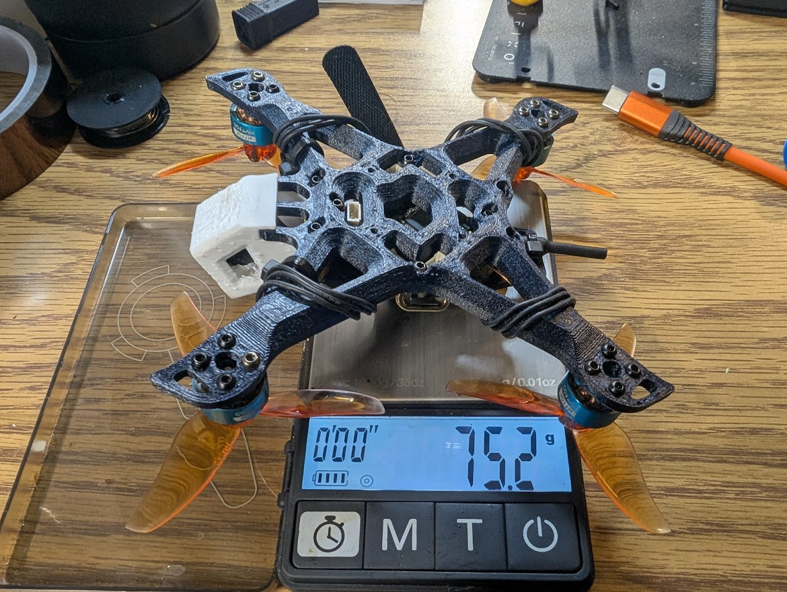

Stubby version of frame cut from 2.5mm Carbon Fiber with RHCP antenna for improved weight and video signal
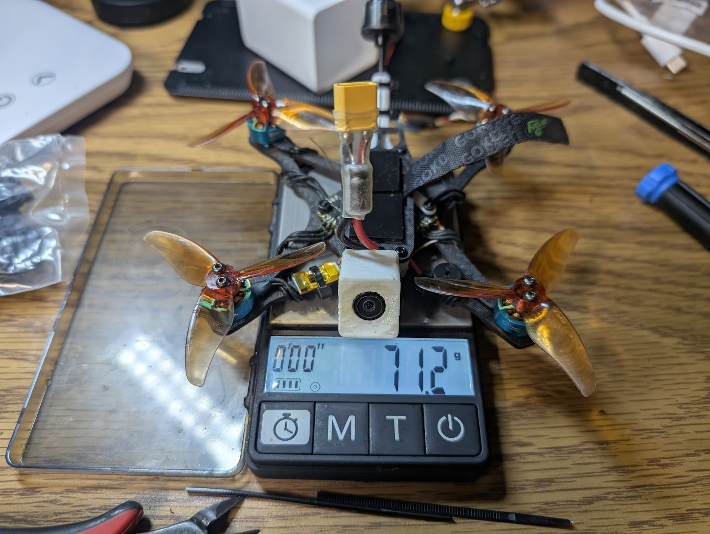

Noise comparison between tunes of 3D printed (blue) and Carbon Fiber (red) variants of frame. As noticeable, the CF frame 10+dB less vibration noise with much less filtering needed to improve responsiveness/delay.

### Stubby vs Sharp
I created a light weight version of the frame for increased agility (and likely more fragile) stubby version weighing in at 10g for the base. Cut from 2.5mm thick CF 6K 2x2 Twill weave
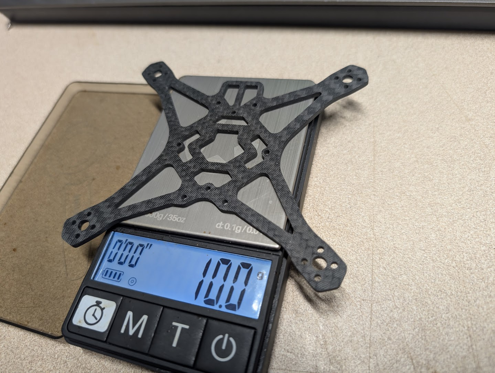

And a heavier 3.4mm carbon (was listed as 3.1) cut from 6K 2x2 Twill weave. Added protrusion to add material in front of motor. Designed for more aggressive bashing, but adds 4.4g to previous design.
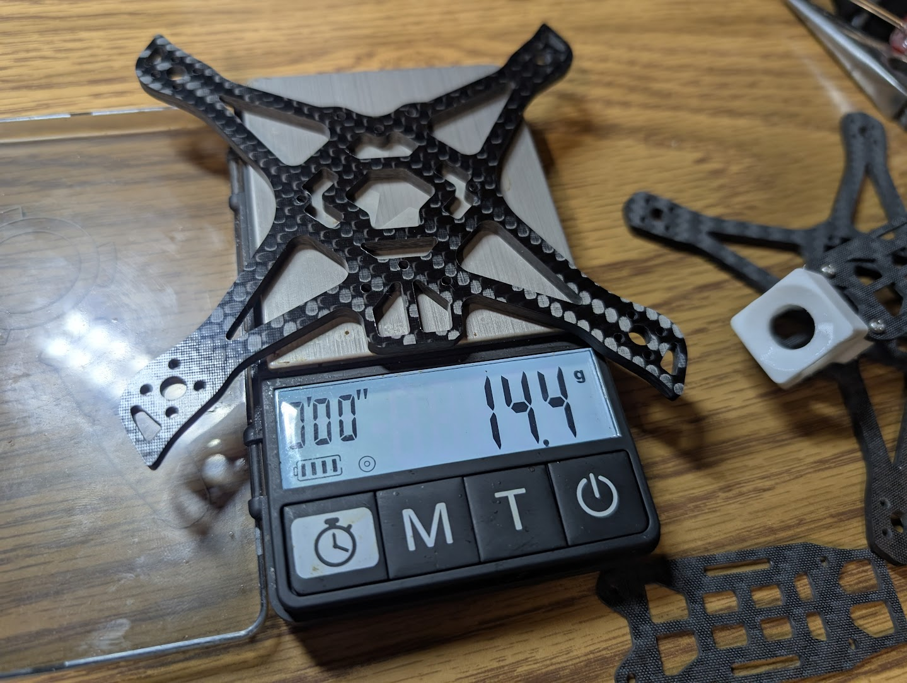

TPU plus CF stubby, top plate, standoffs and main screws comes in at 17.5g
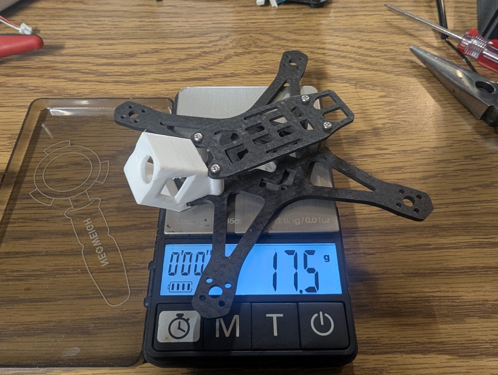

Top plate cut from 1.5mm CF 6k 2x2 twill. Designed with cut out towards the front for battery lead and extension on the back for battery deck/attachment for antenna.
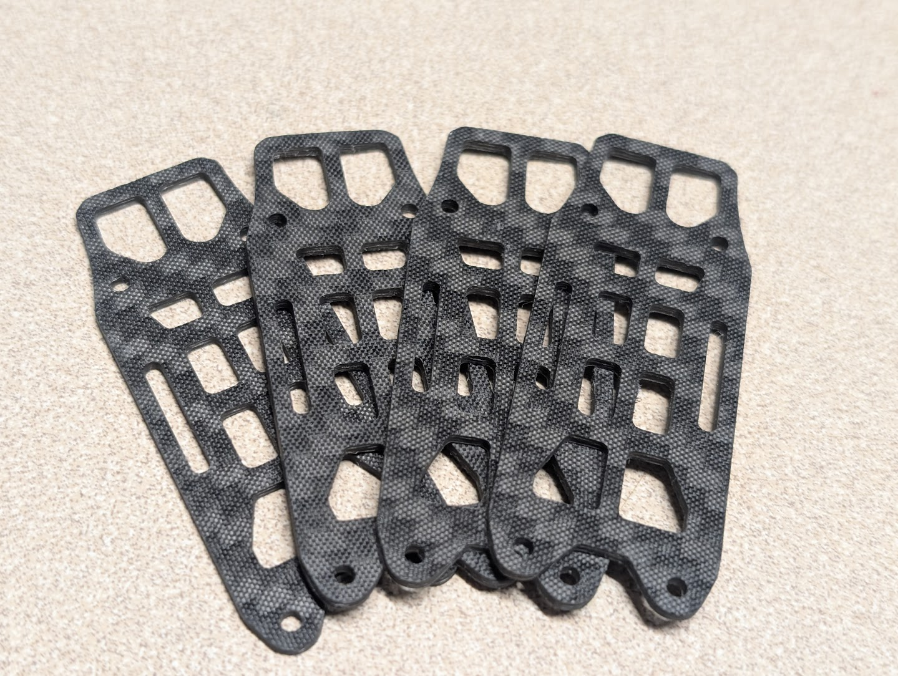

## Recommended-Setup

> [!NOTE]
> *At this size, every gram counts, so tradeoffs must be made to manage durability, range, battery/flight time and flight dynamics.* 

Key considerations for building: 
1. **Weight** of components: Antenna type, TPU mounts and motor guards, battery size. My goa was to have a dry weight under 70g and an AUW of under 100g. For this I found the stubby frame at 2.5mm thick with a circular polarized antenna provided a decent compromise in weight, range, signal quality. For a more racing style setup, I tested the Twiglet frame that allowed me to get as low as 50g using 12025 11000kv motors
2. **Power**: For motor and battery size considerations, I found the HDZero 15A felt solid with 2S in terms of maneuverability. 3S seemed to add quite a bit of weight which required much more throttle to power through sharp corners. With the 2S battery, finding a balance between 8000-11000kv would likely be ideal. I opted for heavier 1104 7500kv which added 4g, but gave me a bit more control with 2" pitch props over 12025 11000kv. That being said, the 12025 felt faster and twitchier, which may be preferable for pilots with better reaction time.
3. **Props**: I tested with GF 2520, 2540 and AVAN Rush (1.9" pitch). By performance, it felt like the Gemfan 2520 yielded the best performance and was less noisy than the AVAN rush. As nice as the AVAN rush felt, it had a high pitched scream that was somewhat unpleasant (and may be a nuisance around others). The GF2540 was explosive in power and worked well with the 1104 motors, but seemed better suited for racing and higher speed lines.
4. **Antenna**: The default stick antenna that comes with the HDZero AIO15 caused a bunch of problems and no matter where I placed the antenna, I always seemed to struggle with noise and range issues. Opting for a circular polarized antenna that I could push further away from the body seemed to help quite a bit in transmission quality during punch-outs. I had tried other stick antennas such as a BetaFPV linear antenna for Air75, but performance still seemed quite bad. 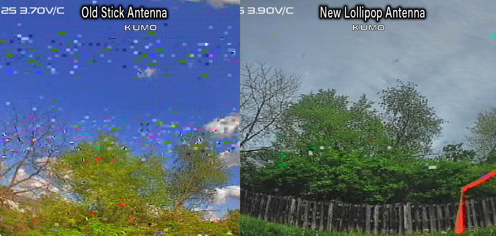
5. **Accessories**: The HDZero AIO15 does not come with a blackbox, which means if you wish to tune, you will need to attach an external recorder. I used a Flywoo OpenLager, which helped narrow down on some of the noise and responsiveness to cut down on propwash. I also added a simple buzzer as this tiny thing is super easy to lose. Adding 1g worth of wire/buzzer/ziptie is totally worth it in my book.

### Example build:
- HDZero AIO15 + Lux camera
- T-motor 1104 7500kv
- Gemfan Hurricane 2520
- Newbeedrone RHCP Honey Dipper Antenna
- 2S battery (450-580mAh)
- Active Buzzer and Flywoo OpenLager blackbox

## Videos

Kumo Frame analysis for stress concentration: (front impact)

Kumo Frame printed first flight

Kumo Frame CNC cut on Millennium Mill

## Changelog/Versions

[Google sheet of various versions with specs, components and photos](https://docs.google.com/spreadsheets/d/1-7FYr2rQ0BzAxG1OKXEforiyXhu9mfht/edit?usp=sharing&ouid=105765567366009761045&rtpof=true&sd=true)

- 5-5-2026: CNC cut stubby frame (youtube video above)
- 4-24-2026: [Tested with 3S... a bit scary](https://www.reddit.com/r/fpv/comments/1suqytk/probably_wasnt_meant_for_3s/)
- 4-20-2026: First flight of Star shaped Kumo frame (youtube video above)
- 4-19-2026: 3D printed version of frame built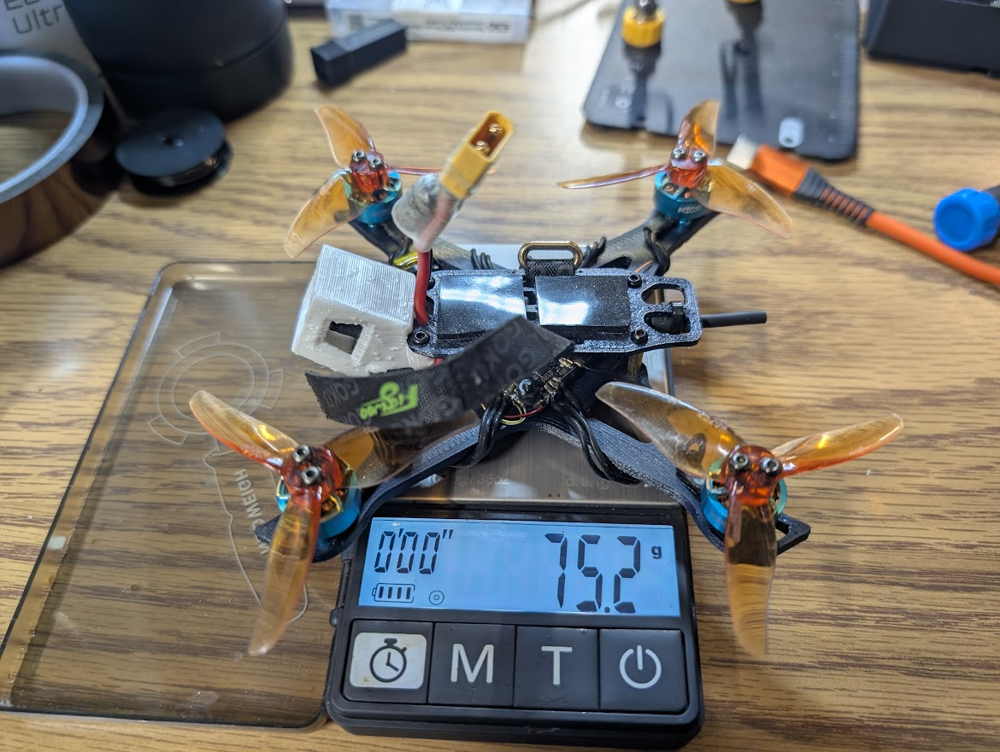
- 4-16-2026: Experimental version of 3D printed frame. Felt very flimsy, added some material around standoff mounts.
- 4-6-2026: Camera mount complete
- 3-28-2026: Experimenting with [Flipped Z design](/CAD/OutdatedDesigns/Frog_MainBody.step)
- 3-27-2026: Stress tests for impact yields concerns with single arm design
- 3-25-2026: First version of Kumo frame  designed (looks like a squished frog)
